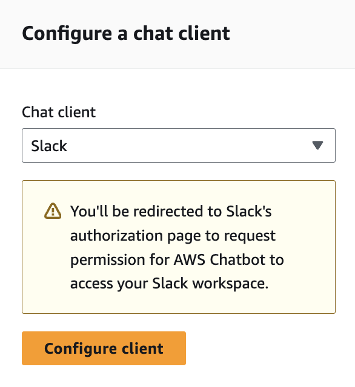
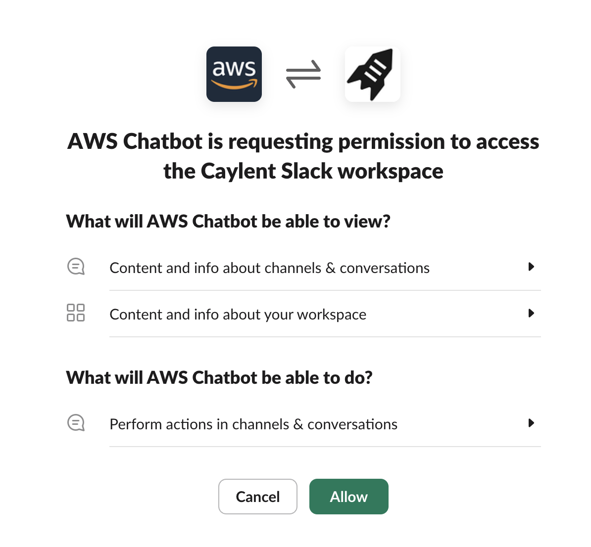
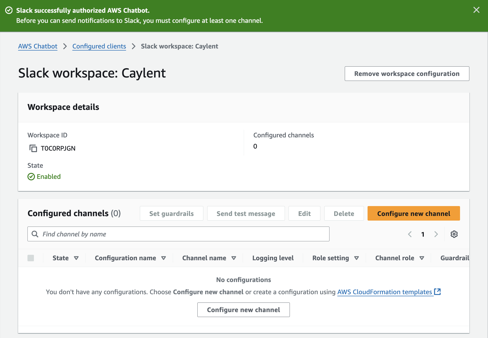
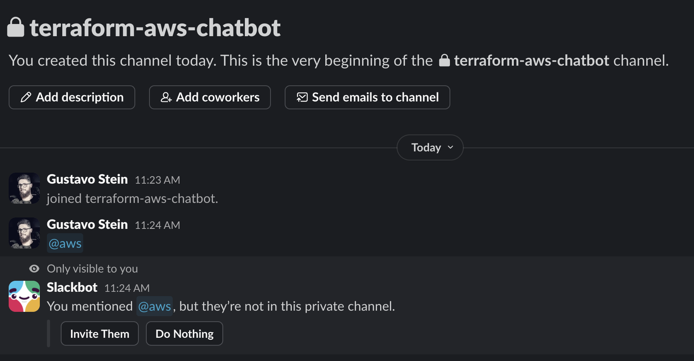
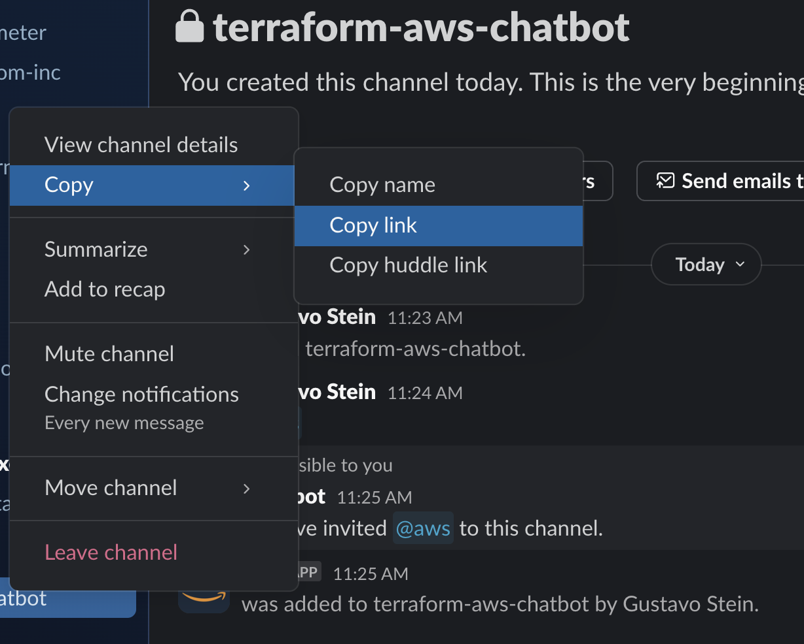
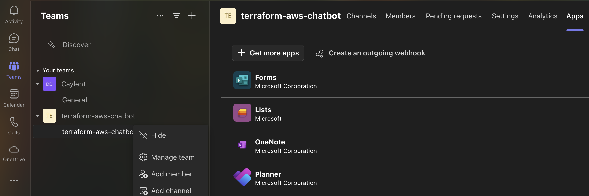
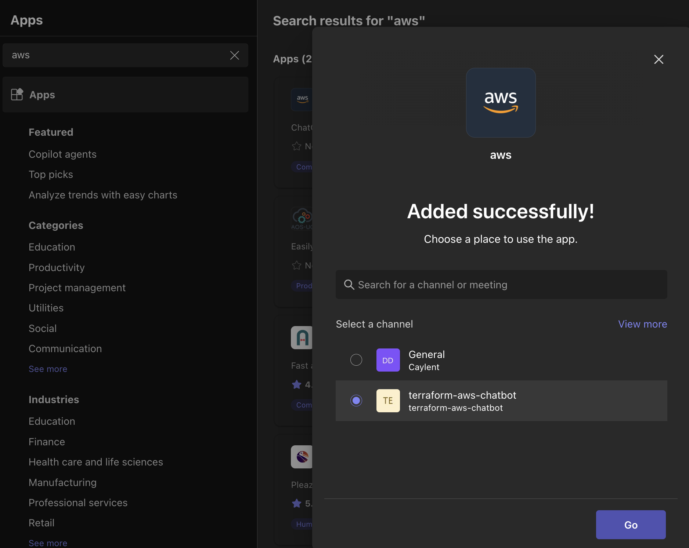
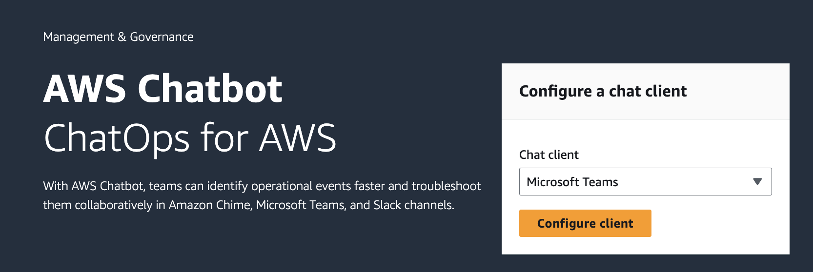
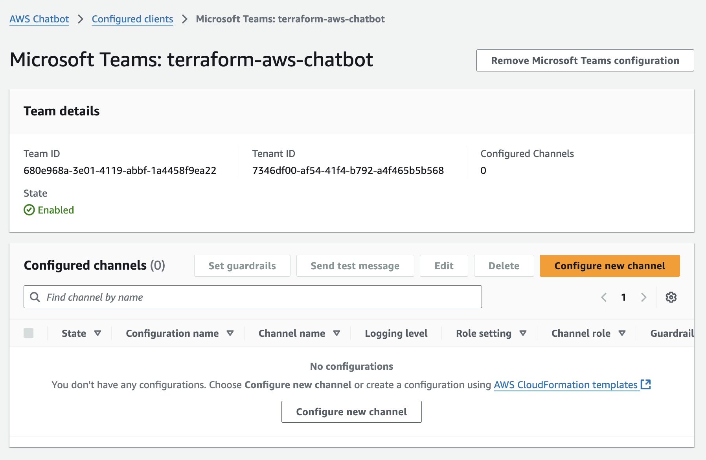

# AWS Chatbot

This module takes care of configuring AWS Chatbot **Channels**. Below you'll find instructions on how to configure the **Clients** such as Slack and Teams. After you configure the clients, you'll have the ability to attach channels to them through code.

> [!NOTE]
> See the [complete example](./examples/complete/main.tf) for how to configure both Slack and Teams channels after the clients are configured.

## Setting Up Slack Client

1. In the [AWS Chatbot Console](https://us-east-2.console.aws.amazon.com/chatbot/home#/home), select `Slack` from the dropdown and click on `Configure client`:

2. That will redirect you to the authorization page. Click on `Allow` to continue:

3. You'll then be redirected back to the console where you'll see the client configured:

> [!TIP]
> In the example above, the `Workspace ID` is `T0C0RPJGN`. Don't ask us why, but in the Terraform code this is referred to as `slack_team_id`.

4. Then go ahead and create a Slack channel. It can be named whatever you want, you only need its ID. After you create the channel, mention `@aws` inside it and answer the Slackbot's question to invite it to the channel:

5. Grab the Slack Channel ID by copying the channel URL and getting the ID from it:

The URL should look like: `https://caylent.slack.com/archives/C07VDLX6KAR`. Hence the Channel ID is `C07VDLX6KAR`. That's what you'll put in the `slack_channel_id` property.

## Setting up Teams Client

1. Chose the `Team` you'd like to connect to AWS Chatbot, right click it and select `Manage team`. Then click on `Apps` and either connect to the `aws` app or click on `Get more apps` to add it:

If you're installing the app for the first time, you'll see the following screen where you can chose the `Team`:

2. Go to the [AWS Chatbot Console](https://us-east-2.console.aws.amazon.com/chatbot/home#/home), select `Microsoft Teams` from the dropdown and click on `Configure client`:

3. Then just copy the link to the Teams channel and paste it. It will look like this:

In the example above, your `team_id` would be `680e968a-3e01-4119-abbf-1a4458f9ea22` and the `tenant_id` would be `7346df00-af54-41f4-b792-a4f465b5b568`.

> [!TIP]
> Your channel URL contains your tenant, team, and channel IDs. You can find your channel URL by right clicking on the channel in your Microsoft Teams channel list and copying the link. Your channel ID is the portion of your channel URL after the path /channel/, starting with 19%3 and likely ending with either thread.tacv2 or thread.skype.
>
> For example, if this is your channel URL: https://teams.microsoft.com/l/channel/19%3AmClUolIkLiqQtIBNQCh3J4aQqEJ9jOHTU93AYfHDA5c1%40thread.tacv2/terraform-aws-chatbot?groupId=680e968a-3e01-4119-abbf-1a4458f9ea22&tenantId=7346df00-af54-41f4-b792-a4f465b5b568, your channel ID is `19%3AmClUolIkLiqQtIBNQCh3J4aQqEJ9jOHTU93AYfHDA5c1%40thread.tacv2`.

## References

- [The API Definition `AWS::Chatbot::SlackChannelConfiguration`](https://docs.aws.amazon.com/AWSCloudFormation/latest/UserGuide/aws-resource-chatbot-slackchannelconfiguration.html)
- [Tutorial: Get started with Slack](https://docs.aws.amazon.com/chatbot/latest/adminguide/slack-setup.html)
- [Tutorial: Get started with Microsoft Teams](https://docs.aws.amazon.com/chatbot/latest/adminguide/teams-setup.html)
- [Identity and Access Management for AWS Chatbot](https://docs.aws.amazon.com/chatbot/latest/adminguide/security-iam.html)

<!-- BEGIN_TF_DOCS -->
## Requirements

| Name | Version |
|------|---------|
|  [aws](#requirement\_aws) | >= 5.34.0 |

## Providers

| Name | Version |
|------|---------|
|  [aws](#provider\_aws) | >= 5.34.0 |

## Modules

No modules.

## Resources

| Name | Type |
|------|------|
| [aws_chatbot_slack_channel_configuration.slack_channels](https://registry.terraform.io/providers/hashicorp/aws/latest/docs/resources/chatbot_slack_channel_configuration) | resource |
| [aws_chatbot_teams_channel_configuration.teams_channels](https://registry.terraform.io/providers/hashicorp/aws/latest/docs/resources/chatbot_teams_channel_configuration) | resource |
| [aws_iam_policy.chatbot_policy](https://registry.terraform.io/providers/hashicorp/aws/latest/docs/resources/iam_policy) | resource |
| [aws_iam_role.chatbot_role](https://registry.terraform.io/providers/hashicorp/aws/latest/docs/resources/iam_role) | resource |
| [aws_iam_role_policy_attachment.chatbot_policy_attachment](https://registry.terraform.io/providers/hashicorp/aws/latest/docs/resources/iam_role_policy_attachment) | resource |
| [aws_iam_policy_document.chatbot_default_policy](https://registry.terraform.io/providers/hashicorp/aws/latest/docs/data-sources/iam_policy_document) | data source |

## Inputs

| Name | Description | Type | Default | Required |
|------|-------------|------|---------|:--------:|
|  [chatbot\_name](#input\_chatbot\_name) | Used to uniquely identify IAM resources. | `string` | n/a | yes |
|  [create\_default\_iam\_role](#input\_create\_default\_iam\_role) | If true, a default IAM role and policy will be created. If false, the user must provide an existing IAM role with the necessary permissions for every channel configuration. If defined, "iam\_role\_arn" is used instead of the default role. | `bool` | `true` | no |
|  [slack\_channel\_configurations](#input\_slack\_channel\_configurations) | Map of Slack channel configurations | <pre>map(object({     configuration_name = string     iam_role_arn       = optional(string) # User-defined role that AWS Chatbot assumes. This is not the service-linked role     slack_channel_id   = string           # For example, C07EZ1ABC23     slack_team_id      = string           # This is the ID you get when you authorize the Slack workspace with AWS Chatbot in UI. See README.md for more details.      # Optionals     guardrail_policy_arns       = optional(list(string)) # The AWS managed AdministratorAccess policy is applied by default if this is not set     logging_level               = optional(string)       # ERROR, INFO, or NONE     sns_topic_arns              = optional(list(string))     user_authorization_required = optional(bool)   }))</pre> | n/a | yes |
|  [teams\_channel\_configurations](#input\_teams\_channel\_configurations) | Map of Teams channel configurations | <pre>map(object({     configuration_name = string     iam_role_arn       = optional(string) # User-defined role that AWS Chatbot assumes. This is not the service-linked role     channel_id         = string           # For example, "19%3AmClUolIkLiqQtIBNQCh3J4aQqEJ9jOHTU93AYfHDA5c1%40thread.tacv2"     team_id            = string           # For example, "680e968a-3e01-4119-abbf-1a4458f9ea22"     tenant_id          = string           # For example, "7346df00-af54-41f4-b792-a4f465b5b568."      # Optionals     guardrail_policy_arns       = optional(list(string)) # The AWS managed AdministratorAccess policy is applied by default if this is not set     logging_level               = optional(string)       # ERROR, INFO, or NONE     sns_topic_arns              = optional(list(string))     user_authorization_required = optional(bool)   }))</pre> | n/a | yes |

## Outputs

No outputs.
<!-- END_TF_DOCS -->
