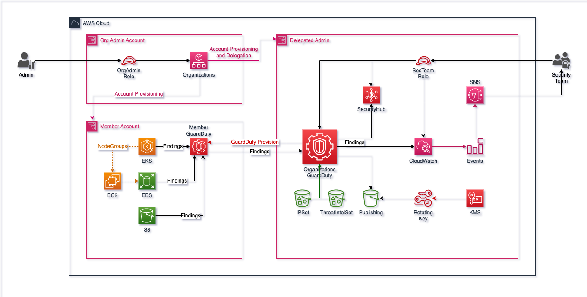
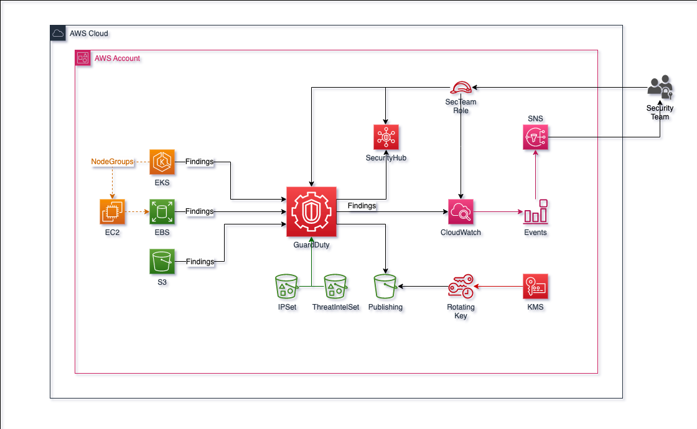
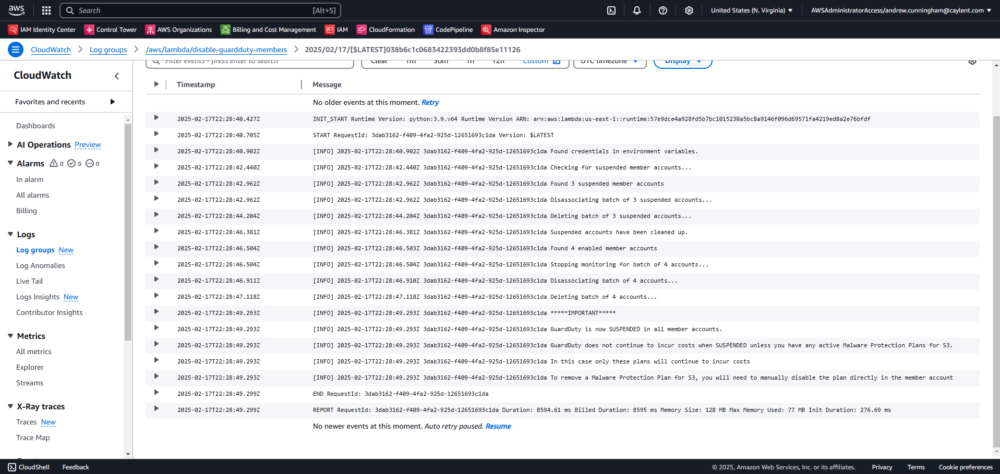
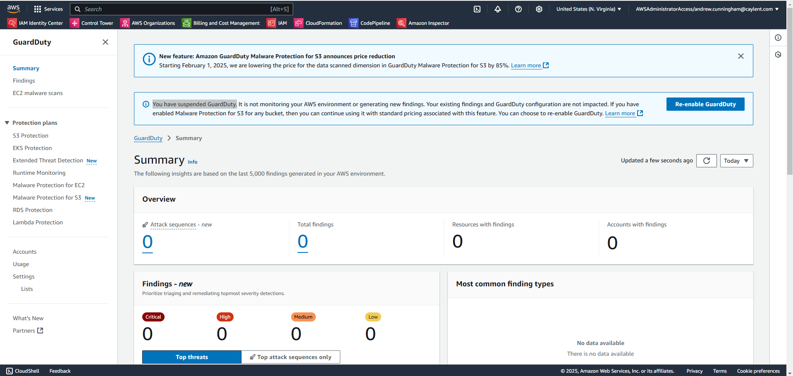
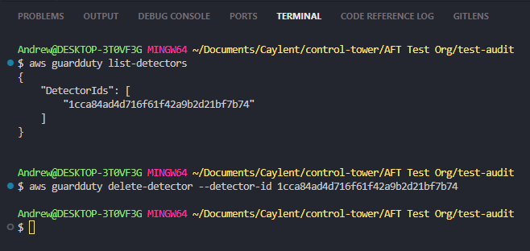

# Terraform AWS GuardDuty Module

The **Terraform AWS GuardDuty Module** provides an automated, configurable, and scalable way to deploy and manage Amazon GuardDuty, an AWS-native threat detection service that continuously monitors AWS environments for malicious activity, unauthorized behavior, and security threats.

## Table of Contents

- [Features](#features)
- [Deploy GuardDuty](#deploy-guardduty)
  - [Set up GuardDuty Delegated Administrator](#set-up-guardduty-delegated-administrator)
  - [GuardDuty Organization Mode](#guardduty-organization-mode)
  - [GuardDuty Standalone Mode](#guardduty-standalone-mode)
    - [Enabling Findings Export in Standalone Mode](#enabling-findings-export-in-standalone-mode)
  - [Enable GuardDuty in Multiple Regions](#enable-guardduty-in-multiple-regions)
- [Disabling GuardDuty](#disabling-guardduty)
- [Re-enabling GuardDuty](#re-enabling-guardduty)
- [GuardDuty Findings Export Configuration](#guardduty-findings-export-configuration)
- [IPSets and ThreatIntelSets](#ipsets-and-threatintelsets)
- [Releases](#releases)

This module supports two deployment modes:

**Standalone Mode** – Deploys GuardDuty in a single AWS account. <br>
**Organization Mode** – Centrally manages GuardDuty across multiple AWS Organization accounts.

## Features

✅ **Configurable Feature Set**: Supports **S3 logs, EKS audit logs, Malware Protection, RDS login events, and more** <br>

✅ **Auto-Enables Organization Members**: Automatically enables GuardDuty for **new, all, or none AWS Organization accounts** <br>
✅ **Secure S3 Log Storage with KMS Encryption**: Findings are **optionally encrypted and stored securely** in an S3 bucket <br>

✅ **Advanced Threat Detection**: Supports **IPSet & ThreatIntelSet configurations** <br>
✅ **Customizable Filters**: Allows **custom rules to filter GuardDuty findings** <br>
✅ **Scalable & Modular**: Works for **single-account and multi-account AWS Organizations** <br>

## Deploy GuardDuty

### Set up GuardDuty Delegated Administrator

**Applicable if you are deploying GuardDuty in an AWS Organization**

In organization mode, GuardDuty will manage the member accounts within the AWS Organization based on your module configuration. Findings can be exported to an S3 bucket.


The architecture diagram used is sourced from the AWS IA [Terraform GuardDuty Module](https://github.com/aws-ia/terraform-aws-guardduty/tree/main/docs).

Using Terraform to delegate Administration for GuardDuty, create the `aws_organizations_delegated_administrator` & `aws_guardduty_organization_admin_account` (region specific) resources:

```hcl
locals {

  account_map = {
    "organization_management" = "098765432109"
    "audit"                   = "123456789012"
  }

}

# Delegate Administration of GuardDuty to the Audit Account
resource "aws_organizations_delegated_administrator" "guardduty_delegated_administrator" {
  service_principal = "guardduty.amazonaws.com"
  account_id        = local.account_map["audit"]
}

# Set the Audit Account has the Administrator of GuardDuty in the current region
resource "aws_guardduty_organization_admin_account" "guardduty_admin_account" {
  admin_account_id = local.account_map["audit"]
}
```

### GuardDuty Organization Mode

#### **Prerequisites**

Before running this module in organization mode, ensure that you have properly configured GuardDuty delegation within your AWS Organization. Follow these steps:

1. In the **AWS Organization Management Account**, delegate GuardDuty administration to the desired **GuardDuty Admin Account**.
2. Refer to the official AWS documentation for detailed instructions:
   👉 [Designating a Delegated GuardDuty Administrator](https://docs.aws.amazon.com/guardduty/latest/ug/delegated-admin-designate.html)
3. Once delegation is complete, execute this module in the **GuardDuty Admin Account**.

```hcl
module "guardduty" {
  source = "../../../"

  # Flag to disable all GuardDuty features and remove all member accounts
  # GuardDuty in memeber accounts will be left in a state of SUSPENDED
  disable_guardduty_members = false

  # Enable GuardDuty for the entire AWS Organization
  enable_organization_configuration          = true
  guardduty_auto_enable_organization_members = "ALL"

  # Enable GuardDuty findings export to S3
  enable_guardduty_findings_export_to_s3 = true
  findings_export_s3_bucket_arn          = "arn:aws:s3:::guardduty-882382790229-us-east-1-findings-export"
  findings_export_kms_key_arn            = "arn:aws:kms:us-east-1:882382790229:key/40919225-f0a8-47c1-a2c6-5d1672558ee1"

  # Controls what GuardDuty features are enabled in the Organization Member accounts
  # You can omit or reduce this block depending on what features you want to set
  guardduty_organization_features = {
    S3_DATA_EVENTS         = { enabled = true, auto_enable_feature_configuration = "NEW" }
    EKS_AUDIT_LOGS         = { enabled = true, auto_enable_feature_configuration = "NEW" }
    EBS_MALWARE_PROTECTION = { enabled = true, auto_enable_feature_configuration = "NEW" }
    RDS_LOGIN_EVENTS       = { enabled = true, auto_enable_feature_configuration = "NEW" }
    LAMBDA_NETWORK_LOGS    = { enabled = true, auto_enable_feature_configuration = "NEW" }

    # EKS_RUNTIME_MONITORING or RUNTIME_MONITORING can be added, adding both features will cause an error.
    RUNTIME_MONITORING = {
      enabled                           = true
      auto_enable_feature_configuration = "NEW"
      additional_configuration = [
        {
          name = "ECS_FARGATE_AGENT_MANAGEMENT"
        },
        {
          name = "EC2_AGENT_MANAGEMENT"
        },
        {
          name        = "EKS_ADDON_MANAGEMENT"
          auto_enable = "NONE" # This disables the feature, remove this line to enable the feature
        }
      ]
    }
  }
}
```

## GuardDuty Standalone Mode

In Standalone Mode, GuardDuty is deployed in a single AWS account and operates independently. It monitors and detects threats within the account, without automatic enrollment of additional AWS Organization accounts. Findings can be published to an S3 bucket, based on your module configuration.


The architecture diagram used is sourced from the AWS IA [Terraform GuardDuty Module](https://github.com/aws-ia/terraform-aws-guardduty/tree/main/docs).

### Deploy Standalone Mode

To deploy GuardDuty in a single AWS account, use the minimal following setup:

```hcl
module "guardduty" {
  source = "../../../"

  # Deploys GuardDuty in standalone account
  enable_organization_configuration = false

  # Enable GuardDuty findings export to S3
  enable_guardduty_findings_export_to_s3 = true
  findings_export_s3_bucket_arn          = "arn:aws:s3:::guardduty-882382790229-us-east-1-findings-export"
  findings_export_kms_key_arn            = "arn:aws:kms:us-east-1:882382790229:key/40919225-f0a8-47c1-a2c6-5d1672558ee1"

  # Enable GuardDuty features
  guardduty_admin_account_features = {
    S3_DATA_EVENTS         = { status = "ENABLED" }
    EKS_AUDIT_LOGS         = { status = "ENABLED" }
    EBS_MALWARE_PROTECTION = { status = "ENABLED" }
    RDS_LOGIN_EVENTS       = { status = "ENABLED" }
    LAMBDA_NETWORK_LOGS    = { status = "ENABLED" }

    # EKS_RUNTIME_MONITORING or RUNTIME_MONITORING can be added, adding both features will cause an error.
    RUNTIME_MONITORING = {
      status = "ENABLED"
      additional_configuration = [
        {
          name = "EKS_ADDON_MANAGEMENT"
          status = "DISABLED"
        },
        {
          name = "EC2_AGENT_MANAGEMENT"
        },
        {
          name = "ECS_FARGATE_AGENT_MANAGEMENT"
          status = "DISABLED" # This disables the feature, remove this line to enable the feature
        }
      ]
    }
    # EKS_RUNTIME_MONITORING = {
    #   status = "ENABLED"
    #   additional_configuration = [
    #     {
    #       name = "EKS_ADDON_MANAGEMENT"
    #     }
    #   ]
    # }
  }
}
```

#### Enabling Findings Export in Standalone Mode

When enabling either of the GuardDuty features for Findings Export to S3 in a standalone account, it is important to be aware that you must apply the module call with `enable_guardduty_findings_export_to_s3 = false`. After the module's resources are created, you can then set `enable_guardduty_findings_export_to_s3 = true` & create the S3 bucket that GuardDuty will export its findings too. If you attempt to deploy GuardDuty with export findings enabled and create the S3 Bucket at the same time while using the modules example bucket policy, terraform will produce a circular dependency related error. This is because the S3 bucket policy explicitly references the GuardDuty Detector. The Detector must be available before creating the bucket to avoid this error.

### Enable GuardDuty in Multiple Regions

If you need to enable GuardDuty across multiple AWS regions:

- In the **Organization Management Account**, repeat the delegation process for each region where GuardDuty should be enabled.
- Ensure that all required regions have been properly set up before running this module.

In Terraform, you can define a new provider for each region you want to deploy GuardDuty in & then create new `aws_guardduty_organization_admin_account` resource using the new provider.

```hcl
provider "aws" {
  region = "us-east-2"
  alias  = "aws-use2"

  assume_role {
    role_arn     = "[ARN of the role to assume]"
    session_name = "tf-use2"
  }

  default_tags {
    tags = {
      Owner              = "[Owner Name]"
      ManagedByTerraform = "True"
    }
  }
}

# ---------------------------------------------
# us-east-2
# Set GuardDuty Administrator account for us-east-2
resource "aws_guardduty_organization_admin_account" "guardduty_admin_account_use2" {
  provider         = aws.aws-use2
  admin_account_id = local.account_map["audit"]
}
```

- After setting the administrator account of GuardDuty in the new region, from the delegated administrator account create a provider for the new region & call the guardduty module.

```hcl
provider "aws" {
  region = "us-east-2"
  alias  = "aws-use2"

  assume_role {
    role_arn     = "[ARN of the role to assume]"
    session_name = "tf-use2"
  }

  default_tags {
    tags = {
      Owner              = "[Owner Name]"
      ManagedByTerraform = "True"
    }
  }
}

# Enable GuardDuty in the us-east-2 region
module "guardduty_use2" {
  source = "../../../"

  providers = {
    aws = aws.aws-use2
  }

  # Flag to disable all GuardDuty features and remove all member accounts
  # GuardDuty in memeber accounts will be left in a state of SUSPENDED
  disable_guardduty_members = false

  # Enable GuardDuty for the entire AWS Organization
  enable_organization_configuration          = true
  guardduty_auto_enable_organization_members = "ALL"

  # Enable GuardDuty findings export to S3
  enable_guardduty_findings_export_to_s3 = true
  findings_export_s3_bucket_arn          = "arn:aws:s3:::guardduty-882382790229-us-east-1-findings-export"
  findings_export_kms_key_arn            = "arn:aws:kms:us-east-1:882382790229:key/40919225-f0a8-47c1-a2c6-5d1672558ee1"

  # Controls what GuardDuty features are enabled in the Organization Member accounts
  guardduty_organization_features = {
    S3_DATA_EVENTS         = { enabled = true, auto_enable_feature_configuration = "NEW" }
    EKS_AUDIT_LOGS         = { enabled = true, auto_enable_feature_configuration = "NEW" }
    EBS_MALWARE_PROTECTION = { enabled = true, auto_enable_feature_configuration = "NEW" }
    RDS_LOGIN_EVENTS       = { enabled = true, auto_enable_feature_configuration = "NEW" }
    LAMBDA_NETWORK_LOGS    = { enabled = true, auto_enable_feature_configuration = "NEW" }

    # EKS_RUNTIME_MONITORING or RUNTIME_MONITORING can be added, adding both features will cause an error.
    RUNTIME_MONITORING = {
      enabled                           = true
      auto_enable_feature_configuration = "NEW"
      additional_configuration = [
        {
          name = "ECS_FARGATE_AGENT_MANAGEMENT"
        },
        {
          name = "EC2_AGENT_MANAGEMENT"
        },
        {
          name        = "EKS_ADDON_MANAGEMENT"
          auto_enable = "NONE" # This disables the feature, remove this line to enable the feature
        }
      ]
    }
    # EKS_RUNTIME_MONITORING = {
    #   enabled = true
    #   auto_enable_feature_configuration = "NEW"
    #   additional_configuration = [
    #     {
    #       name = "EKS_ADDON_MANAGEMENT"
    #     }
    #   ]
    # }
  }
}
```

## Complete Example

You can find the **complete example** here: [📌 Complete Example](./examples/complete/)

This module allows you to **configure both organization-wide and standalone deployments** using the **same structure**.
Simply enable or disable **enable_organization_configuration** as needed to fit your AWS security strategy. 🚀

## Disabling GuardDuty

Follow this process for disabling AWS GuardDuty if you have deployed the module using an `Organization configuration`. This is a multi-step process that ensures proper cleanup of GuardDuty configurations across your organization. If you have deployed GuardDuty into a standalone account, all you need to do is follow Step 2, removing the module call.

### Step 1: Set the `disable_guardduty_members` variable to true

Setting `disable_guardduty_members = true` will set all GuardDuty features to `NONE` & then create the `disable_guardduty_members.py` lambda function. Once the function is created, it is automatically triggered. After the function is triggered, GuardDuty will become SUSPENDED in all member accounts. Any member account with an active Malware Protection for S3 feature will incur costs. You will need to manually disable Malware Protection for S3 in member accounts to stop inccuring these costs. [See more here](https://docs.aws.amazon.com/guardduty/latest/ug/guardduty_suspend-disable.html)

The `disable-guardduty-members` lambda function will:

1. Organization Configuration Changes:
   - Sets auto-enable for new accounts to "NONE"
   - Disables all organization features
   - Sets all feature auto-enable configurations to "NONE"

2. Cleanup Script Execution:
   - Removes any SUSPENDED member accounts from GuardDuty.
   - Removes all member accounts from GuardDuty:
     - Stops monitoring each member account.
     - Disassociates each member from the GuardDuty Admin Account.
     - Deletes each member account from the GuardDuty Organization Configuration.

```hcl
module "guardduty" {
  source = "../../../"

  # Set the disable flag to true
  disable_guardduty_members = true

  # Keep other configurations as is
}
```

Run `terraform apply`.

### Step 2: Verify disable-guardduty-members lambda function executed successfully

After the `disable-guardduty-members` lambda function executes, verify that it has successfully dissasociated and deleted all member accounts from GuardDuty by:

1. Viewing its function logs in Cloudwatch Logs

- Navagate to Cloudwatch > Log groups > Click into the log group `/aws/lambda/disable-guardduty-members`

- Select the most recent log stream and verify the function executed successfully, you should see a log output stating: `GuardDuty is now SUSPENDED in all member accounts.`.



2. Check GuardDuty in the member accounts

- Sign into a member account and navagate to the GuardDuty console. GuardDuty will display a message indicating that you have `SUSPENDED` GuardDuty.



### Step 3: Remove GuardDuty module call

Comment out / remove the module call for guardduty, this will:

1. If `var.enable_guardduty_findings_export_to_s3` is true, the S3 bucket containing GuardDuty's findings exports will be deleted
2. Delete any GuardDuty Filters
3. Delete any GuardDuty IPSets
4. Delete any GuardDuty ThreatIntelSets

Run `terraform apply`.

### Step 4: Remove GuardDuty's Organization Delegated Administrator Account

Depending on how you delegated administration of GuardDuty in your organization (either through Terraform or some other method), you will need to remove the delegation of GuardDuty from within your Organization's Management Account.

- In terraform remove the following resources from your Organization's Management Account:

```hcl
resource "aws_organizations_delegated_administrator" "guardduty_administration_delegation" {
  account_id        = local.account_map["audit"]
  service_principal = "guardduty.amazonaws.com"
}

resource "aws_guardduty_organization_admin_account" "guardduty_admin_account" {
  depends_on = [aws_organizations_delegated_administrator.guardduty]

  admin_account_id = local.account_map["audit"]
}
```

Run `terraform apply`.

### Step 5: Delete the Delegated Administrator Account's GuardDuty Detector

Back in the origional Delegated Administrator Account of GuardDuty, delete its GuardDuty Detector. This disables GuardDuty in the account.

Run the following AWS CLI commands using credentials in the Delegated Administrator Account:

```bash
aws guardduty list-detectors

aws guardduty delete-detector --detector-id <detector-id>
```



### Step 6: Optionally delete GuardDuty Detector for member accounts

Currently, GuardDuty in your member accounts will have be in a SUSPENDED State. You will not incur any costs when GuardDuty is in a SUSPENDED State, unless Malware Protection for S3 is enabled. In this case, only this feature will incur costs. Any member account can reenable GuardDuty at anytime. If you would like to reset GuardDuty completely in member accounts, you can manually remove its GuardDuty Detector by running the same AWS CLI commands from the previous step & manually deleting any active Malware Protection for S3 plans.

## Re-enabling GuardDuty

To re-enable GuardDuty:

1. Set the Organizations Delegated Administrator Account of GuardDuty
2. Set `disable_guardduty_members = false`
3. Re-configure desired features
4. Run `terraform apply`
5. Verify member accounts are properly enrolled

## GuardDuty Findings Export Configuration

This module supports exporting GuardDuty findings to an S3 bucket. The functionality includes options for both enabling/disabling the export feature and managing the retention of historical findings data when the export feature is disabled.

### Variables

| Name | Description | Type | Default | Required |
|------|-------------|------|---------|:--------:|
| `enable_guardduty_findings_export_to_s3` | Determines whether GuardDuty findings should be exported to S3. | `bool` | `false` | no |
| `findings_export_s3_bucket_arn` | ARN and prefix (optional) of the S3 bucket under which GuardDuty will export its findings too. Bucket ARN is required, the prefix is optional and will be s3://BucketName/AWSLogs/[Account-ID]/GuardDuty/[Region]/ if not provided. | `string` | `null` | no |
| `findings_export_kms_key_arn` | ARN of the KMS key GuardDuty will use when exporting its findings. | `string` | `null` | no |

## IPSets and ThreatIntelSets

Trusted IP lists and threat lists apply only to traffic destined for publicly routable IP addresses. The effects of a list apply to all VPC Flow Log and CloudTrail findings, but do not apply to DNS findings. Read more about these features [here](https://docs.aws.amazon.com/guardduty/latest/ug/guardduty_upload-lists.html)

- **IPSet's**: a list of IP addresses that are trusted for secure communication with AWS infrastructure and applications. GuardDuty doesn't generate findings for IP addresses that are included in IPSets. Only users from the administrator account can use this operation.
- **ThreatIntelSets**: a list of known malicious IP addresses. GuardDuty monitors your accounts for activity from these malicious IP's & will generate findings based on these threat lists.

### Creating IPSets or ThreatIntelSets

1. Create S3 Bucket with a Bucket Policy allowing the GuardDuty Service to read and write too it.
2. Create .txt files within the module call directory (e.g. `guardduty/trusted-ips.txt`, `guardduty/threat-intel-ips.txt`)
3. Add the IP addresses to the files
4. Update the `ipset_config` or `threatintelset_config` variables in the module call with the new file paths
5. Run `terraform apply`

### IMPORTANT NOTES

- To `enable_organization_configuration`, ensure AWS Organizations is properly configured before enabling GuardDuty. Follow the steps in the [AWS Documentation](https://docs.aws.amazon.com/guardduty/latest/ug/guardduty_orgs.html).
- `guardduty_auto_enable_organization_members` controls whether new AWS Organization accounts automatically enable GuardDuty. See [Setting organization auto-enable preferences](https://docs.aws.amazon.com/guardduty/latest/ug/set-guardduty-auto-enable-preferences.html)
**Options:**
  - `ALL` ensures all accounts within the Organization enable GuardDuty. This can increase costs unnecessarily if any account does not require coverage.
  - `NEW` activates GuardDuty only in accounts that are created or added to the Organization after deploying the module.
  - `NONE` does not enable GuardDuty automatically in any member account.
  - `guardduty_organization_features` & `guardduty_admin_account_features` defines which GuardDuty features will be enabled. Additional configurations apply only for features `EKS_RUNTIME_MONITORING` or `RUNTIME_MONITORING`. See the [Terraform resource guardduty_detector_feature](https://registry.terraform.io/providers/hashicorp/aws/latest/docs/resources/guardduty_detector_feature).
  - Enabling more features increases threat visibility but may generate higher log volume and costs.
  - Some features require additional configuration to function properly.
- `ipset_config` defines IP lists that GuardDuty will use for threat detection.
  - Trusted IPs can be added to avoid false positives.
  - Outdated lists may lead to inefficient detection.
- `threatintelset_config` defines threat intelligence sets that GuardDuty will use.
  - Well-maintained lists enhance threat detection effectiveness.
  - Generic lists may generate excessive alerts.

<!-- BEGIN_TF_DOCS -->
## Requirements

No requirements.

## Providers

| Name | Version |
|------|---------|
| <a name="provider_aws"></a> [aws](#provider\_aws) | n/a |
| <a name="provider_random"></a> [random](#provider\_random) | n/a |

## Modules

No modules.

## Resources

| Name | Type |
|------|------|
| [aws_guardduty_detector.this](https://registry.terraform.io/providers/hashicorp/aws/latest/docs/resources/guardduty_detector) | resource |
| [aws_guardduty_detector_feature.this](https://registry.terraform.io/providers/hashicorp/aws/latest/docs/resources/guardduty_detector_feature) | resource |
| [aws_guardduty_filter.this](https://registry.terraform.io/providers/hashicorp/aws/latest/docs/resources/guardduty_filter) | resource |
| [aws_guardduty_ipset.this](https://registry.terraform.io/providers/hashicorp/aws/latest/docs/resources/guardduty_ipset) | resource |
| [aws_guardduty_organization_configuration_feature.this](https://registry.terraform.io/providers/hashicorp/aws/latest/docs/resources/guardduty_organization_configuration_feature) | resource |
| [aws_guardduty_publishing_destination.this](https://registry.terraform.io/providers/hashicorp/aws/latest/docs/resources/guardduty_publishing_destination) | resource |
| [aws_guardduty_threatintelset.this](https://registry.terraform.io/providers/hashicorp/aws/latest/docs/resources/guardduty_threatintelset) | resource |
| [aws_kms_alias.guardduty_key_alias](https://registry.terraform.io/providers/hashicorp/aws/latest/docs/resources/kms_alias) | resource |
| [aws_kms_key.guardduty_key](https://registry.terraform.io/providers/hashicorp/aws/latest/docs/resources/kms_key) | resource |
| [aws_kms_key_policy.guardduty_kms_policy](https://registry.terraform.io/providers/hashicorp/aws/latest/docs/resources/kms_key_policy) | resource |
| [aws_s3_bucket.log_bucket](https://registry.terraform.io/providers/hashicorp/aws/latest/docs/resources/s3_bucket) | resource |
| [aws_s3_bucket_policy.log_bucket](https://registry.terraform.io/providers/hashicorp/aws/latest/docs/resources/s3_bucket_policy) | resource |
| [aws_s3_bucket_public_access_block.log_bucket](https://registry.terraform.io/providers/hashicorp/aws/latest/docs/resources/s3_bucket_public_access_block) | resource |
| [aws_s3_bucket_server_side_encryption_configuration.log_bucket](https://registry.terraform.io/providers/hashicorp/aws/latest/docs/resources/s3_bucket_server_side_encryption_configuration) | resource |
| [aws_s3_bucket_versioning.log_bucket](https://registry.terraform.io/providers/hashicorp/aws/latest/docs/resources/s3_bucket_versioning) | resource |
| [aws_s3_object.ipset_object](https://registry.terraform.io/providers/hashicorp/aws/latest/docs/resources/s3_object) | resource |
| [aws_s3_object.threatintelset_object](https://registry.terraform.io/providers/hashicorp/aws/latest/docs/resources/s3_object) | resource |
| [random_string.log_bucket_suffix](https://registry.terraform.io/providers/hashicorp/random/latest/docs/resources/string) | resource |
| [aws_caller_identity.current](https://registry.terraform.io/providers/hashicorp/aws/latest/docs/data-sources/caller_identity) | data source |
| [aws_guardduty_detector.current](https://registry.terraform.io/providers/hashicorp/aws/latest/docs/data-sources/guardduty_detector) | data source |
| [aws_iam_policy_document.guardduty_kms_policy](https://registry.terraform.io/providers/hashicorp/aws/latest/docs/data-sources/iam_policy_document) | data source |
| [aws_iam_policy_document.guardduty_log_policy](https://registry.terraform.io/providers/hashicorp/aws/latest/docs/data-sources/iam_policy_document) | data source |
| [aws_region.current](https://registry.terraform.io/providers/hashicorp/aws/latest/docs/data-sources/region) | data source |

## Inputs

| Name | Description | Type | Default | Required |
|------|-------------|------|---------|:--------:|
| <a name="input_auto_enable_organization_members"></a> [auto\_enable\_organization\_members](#input\_auto\_enable\_organization\_members) | Controls whether new AWS organization accounts are automatically added as GuardDuty member accounts under the delegated administrator in the specified AWS region. Valid values: ALL, NEW, NONE. | `string` | `"NONE"` | no |
| <a name="input_aws_guardduty_detector_id"></a> [aws\_guardduty\_detector\_id](#input\_aws\_guardduty\_detector\_id) | The Guardduty detector ID | `any` | `null` | no |
| <a name="input_enable_organization"></a> [enable\_organization](#input\_enable\_organization) | Determines whether organization-wide features are enabled for AWS GuardDuty. | `bool` | `false` | no |
| <a name="input_enable_publishing_destination"></a> [enable\_publishing\_destination](#input\_enable\_publishing\_destination) | Determines whether GuardDuty findings should be published to configured destinations (e.g., S3). Set to false to disable all publishing. | `bool` | `true` | no |
| <a name="input_features_enabled"></a> [features\_enabled](#input\_features\_enabled) | Defines which GuardDuty features are enabled with individual auto-enable configurations. Each feature includes:<br/>    - `enabled` (bool): Specifies if the GuardDuty feature should be enabled.<br/>    - `additional_configuration` (list of objects, optional): Optional additional configurations for specific GuardDuty features.<br/>      - `name` (string): Name of the additional configuration setting. Allowed values: EC2\_AGENT\_MANAGEMENT, ECS\_FARGATE\_AGENT\_MANAGEMENT, EKS\_ADDON\_MANAGEMENT.<br/>      - `status` (string): Status of the additional configuration setting. Allowed values: enabled, disabled. | <pre>map(object({<br/>    enabled = bool<br/>    additional_configuration = optional(list(object({<br/>      name   = string<br/>      status = string<br/>    })))<br/>  }))</pre> | <pre>{<br/>  "EBS_MALWARE_PROTECTION": {<br/>    "enabled": false<br/>  },<br/>  "EKS_AUDIT_LOGS": {<br/>    "enabled": false<br/>  },<br/>  "LAMBDA_NETWORK_LOGS": {<br/>    "enabled": false<br/>  },<br/>  "RDS_LOGIN_EVENTS": {<br/>    "enabled": false<br/>  },<br/>  "RUNTIME_MONITORING": {<br/>    "additional_configuration": [<br/>      {<br/>        "name": "EC2_AGENT_MANAGEMENT",<br/>        "status": "DISABLE"<br/>      },<br/>      {<br/>        "name": "ECS_FARGATE_AGENT_MANAGEMENT",<br/>        "status": "DISABLE"<br/>      },<br/>      {<br/>        "name": "EKS_ADDON_MANAGEMENT",<br/>        "status": "DISABLE"<br/>      }<br/>    ],<br/>    "enabled": false<br/>  },<br/>  "S3_DATA_EVENTS": {<br/>    "enabled": false<br/>  }<br/>}</pre> | no |
| <a name="input_filter_config"></a> [filter\_config](#input\_filter\_config) | Defines AWS GuardDuty filter configurations. Each filter contains:<br/>  - `name` (string): The name of the filter.<br/>  - `description` (optional, string): Description of the filter.<br/>  - `rank` (number): The priority rank of the filter, determining the order in which it is applied.<br/>  - `action` (string): The action to apply to matched findings. Valid values: ARCHIVE or NOOP.<br/>  - `criterion` (list of objects): Defines the filtering criteria with:<br/>      - `field` (string): The field to filter on.<br/>      - `equals`, `not_equals` (optional, list of strings): Exact match conditions.<br/>      - `greater_than`, `greater_than_or_equal`, `less_than`, `less_than_or_equal` (optional, string): Numeric comparison conditions. | <pre>list(object({<br/>    name        = string<br/>    description = optional(string)<br/>    rank        = number<br/>    action      = string<br/>    criterion = list(object({<br/>      field                 = string<br/>      equals                = optional(list(string))<br/>      not_equals            = optional(list(string))<br/>      greater_than          = optional(string)<br/>      greater_than_or_equal = optional(string)<br/>      less_than             = optional(string)<br/>      less_than_or_equal    = optional(string)<br/>    }))<br/>  }))</pre> | `[]` | no |
| <a name="input_finding_publishing_frequency"></a> [finding\_publishing\_frequency](#input\_finding\_publishing\_frequency) | Specifies how often GuardDuty findings are published. Allowed values: FIFTEEN\_MINUTES, ONE\_HOUR, SIX\_HOURS. | `string` | `"SIX_HOURS"` | no |
| <a name="input_guardduty_bucket_acl"></a> [guardduty\_bucket\_acl](#input\_guardduty\_bucket\_acl) | Canned ACL applied to the GuardDuty S3 bucket. Valid values: private, public-read, public-read-write, aws-exec-read, authenticated-read, bucket-owner-read, bucket-owner-full-control. | `string` | `null` | no |
| <a name="input_ipset_config"></a> [ipset\_config](#input\_ipset\_config) | Defines AWS GuardDuty IPSet configuration. Each IPSet contains:<br/>  - `activate` (bool): Specifies if GuardDuty should start using the uploaded IPSet.<br/>  - `name` (string): The friendly name to identify the IPSet.<br/>  - `format` (string): Format of the IPSet file. Valid values: TXT, STIX, OTX\_CSV, ALIEN\_VAULT, PROOF\_POINT, FIRE\_EYE.<br/>  - `content` (string): Literal string value with the IPSet content.<br/>  - `key` (string): Name of the object stored in the S3 bucket. | <pre>list(object({<br/>    activate = bool<br/>    name     = string<br/>    format   = string<br/>    content  = string<br/>    key      = string<br/>  }))</pre> | `[]` | no |
| <a name="input_kms_name"></a> [kms\_name](#input\_kms\_name) | Alias of the KMS key used for encrypting GuardDuty log findings. | `string` | n/a | yes |
| <a name="input_publishing_config"></a> [publishing\_config](#input\_publishing\_config) | Defines the findings publishing configuration. Must specify only one destination type: `S3` or `SNS`.<br/>Each publishing destination contains:<br/>  - `destination_arn` (string): ARN of the publishing destination (e.g., S3 bucket or SNS topic).<br/>  - `kms_key_arn` (string): ARN of the KMS key used for encryption.<br/>  - `destination_type` (string): The type of publishing destination. Allowed values: S3. | <pre>list(object({<br/>    destination_arn  = string<br/>    kms_key_arn      = string<br/>    destination_type = string<br/>  }))</pre> | <pre>[<br/>  {<br/>    "destination_arn": null,<br/>    "destination_type": "S3",<br/>    "kms_key_arn": null<br/>  }<br/>]</pre> | no |
| <a name="input_tags"></a> [tags](#input\_tags) | Map of tags to apply to all resources. | `map(string)` | `{}` | no |
| <a name="input_threatintelset_config"></a> [threatintelset\_config](#input\_threatintelset\_config) | Defines AWS GuardDuty ThreatIntelSet configuration. Each ThreatIntelSet contains:<br/>  - `activate` (bool): Specifies if GuardDuty should start using the uploaded ThreatIntelSet.<br/>  - `name` (string): The friendly name to identify the ThreatIntelSet.<br/>  - `format` (string): Format of the file. Valid values: TXT, STIX, OTX\_CSV, ALIEN\_VAULT, PROOF\_POINT, FIRE\_EYE.<br/>  - `content` (string): Literal string value with the ThreatIntelSet content.<br/>  - `key` (string): Name of the object stored in the S3 bucket.<br/>  - `object_acl` (string): Canned ACL to apply. Valid values: private, public-read, public-read-write, aws-exec-read, authenticated-read, bucket-owner-read, bucket-owner-full-control. | <pre>list(object({<br/>    activate   = bool<br/>    name       = string<br/>    format     = string<br/>    content    = string<br/>    key        = string<br/>    object_acl = string<br/>  }))</pre> | `[]` | no |

## Outputs

| Name | Description |
|------|-------------|
| <a name="output_guardduty_detector_id"></a> [guardduty\_detector\_id](#output\_guardduty\_detector\_id) | The ID of the GuardDuty detector |
| <a name="output_guardduty_filters"></a> [guardduty\_filters](#output\_guardduty\_filters) | List of GuardDuty filters |
| <a name="output_guardduty_ipset_ids"></a> [guardduty\_ipset\_ids](#output\_guardduty\_ipset\_ids) | The IDs of the GuardDuty IP sets |
| <a name="output_guardduty_kms_key_arn"></a> [guardduty\_kms\_key\_arn](#output\_guardduty\_kms\_key\_arn) | The ARN of the KMS key used for GuardDuty log encryption |
| <a name="output_guardduty_publishing_destination"></a> [guardduty\_publishing\_destination](#output\_guardduty\_publishing\_destination) | The ARN of the GuardDuty publishing destination |
| <a name="output_guardduty_threatintelset_ids"></a> [guardduty\_threatintelset\_ids](#output\_guardduty\_threatintelset\_ids) | The IDs of the GuardDuty ThreatIntel sets |
| <a name="output_s3_bucket_log_arn"></a> [s3\_bucket\_log\_arn](#output\_s3\_bucket\_log\_arn) | The ARN of the S3 bucket used for GuardDuty logs |
| <a name="output_s3_bucket_log_name"></a> [s3\_bucket\_log\_name](#output\_s3\_bucket\_log\_name) | The name of the S3 bucket used for GuardDuty logs |
| <a name="output_s3_ipset_objects"></a> [s3\_ipset\_objects](#output\_s3\_ipset\_objects) | S3 object keys for GuardDuty IP sets |
| <a name="output_s3_threatintelset_objects"></a> [s3\_threatintelset\_objects](#output\_s3\_threatintelset\_objects) | S3 object keys for GuardDuty ThreatIntel sets |

<!-- END_TF_DOCS -->
