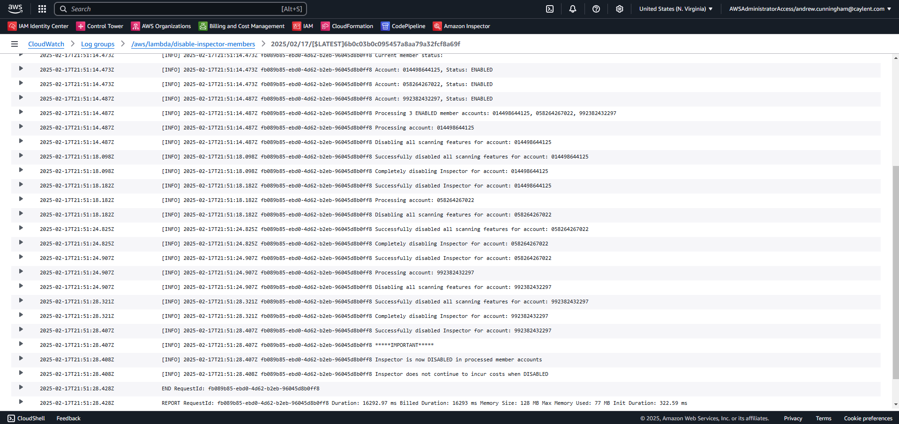
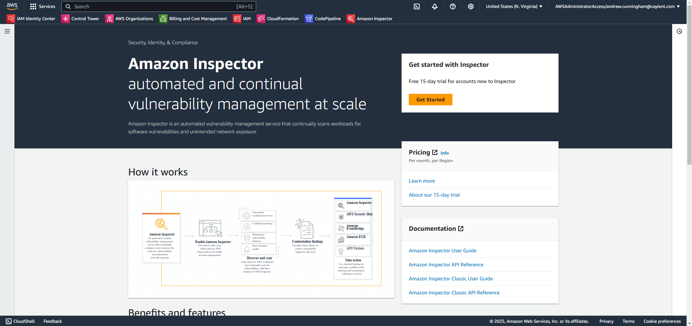

# AWS Inspector Terraform Module

Amazon Inspector is an automated vulnerability management service that continually scans Amazon EC2 and container workloads for software vulnerabilities and unintended network exposure.

Using Amazon Inspector you can manage all your accounts that are associated through AWS Organizations by simply delegating an administrator account for Amazon Inspector. The delegated administrator manages Amazon Inspector for the organization and is granted special permissions to perform tasks on behalf of your organization such as:

- Enable or disable scans for member accounts
- View aggregated finding data from the entire organization

Understand the relationship between the Inspector delegated administrator account and the member accounts [here](https://docs.aws.amazon.com/inspector/latest/user/admin-member-relationship.html).

## Table of Contents

- [Prerequisites](#prerequisites)
- [Module Inputs](#module-inputs)
- [Supported Scanning Features](#supported-scanning-features)
- [Deploying Inspector](#deploying-inspector)
  - [Set up Inspector Delegated Administrator](#set-up-inspector-delegated-administrator)
  - [Inspector Organization Mode](#inspector-organization-mode)
  - [Inspector Standalone Mode](#inspector-standalone-mode)
  - [Enable Inspector in Multiple Regions](#enable-inspector-in-multiple-regions)
- [Disabling Inspector](#disabling-inspector)
- [Re-enabling Inspector](#re-enabling-inspector)
- [Important Notes](#important-notes)
- [Releases](#releases)

## Prerequisites

**Note:** Before using this module to configure AWS Inspector within an organization, ensure that an administrator account has been delegated for AWS Inspector through the organization's management account. For more information, refer to [Amazon Inspector with AWS Organizations](https://docs.aws.amazon.com/inspector/latest/user/managing-multiple-accounts.html).

- AWS Provider configured with delegated administrator account credentials
- AWS Organizations set up
- Appropriate IAM permissions to manage Inspector settings

## Module Inputs

| Name | Description | Type | Default | Required |
|------|-------------|------|---------|----------|
| `excluded_accounts` | List of account id's to exclude from Inspector configuration | `list(string)` | `[]` | No |
| `resource_scan_types` | List of inspector resource scan types to enable | `list(string)` | `[]` | Yes |
| `enable_organization_configuration` | If you want to manage Inspector across accounts in an AWS Organization | `bool` | `true` | No |
| `disable_inspector_members` | If you want to disable Inspector | `bool` | `false` | No |
| `inspector_delegated_admin_account_id` | The account ID of the Inspector Delegated Administrator Account | `string` | `""` | Yes |

## Supported Scanning Features

### EC2 Scanning

- Scans Amazon EC2 instances for software vulnerabilities
- Analyzes operating system and software package vulnerabilities

### ECR Scanning

- Scans container images in Amazon Elastic Container Registry
- Identifies software vulnerabilities in container images

### Lambda Scanning

Amazon Inspector offers two types of Lambda scanning:

1. **Lambda Standard Scanning**

  - Default Lambda scan type
  - Scans application dependencies within Lambda functions and layers
  - Identifies package vulnerabilities in dependencies
  - Required baseline for Lambda code scanning

2. **Lambda Code Scanning**

  - Advanced scanning of custom application code
  - Analyzes function and layer code for vulnerabilities
  - Requires Lambda standard scanning to be enabled
  - Cannot be enabled independently of standard scanning

> **Note**: When enabling Lambda scanning, you can either activate standard scanning alone or standard scanning with code scanning. Code scanning cannot be enabled without standard scanning.

## Deploying Inspector

### Set up Inspector Delegated Administrator

**If you are deploying Inspector in an AWS Organization**

From your Organization Management Account, create the following resources to delegate administration of inspector and set its admin account (region specific).

```hcl
locals {

  account_map = {
    "organization_management" = "098765432109"
    "audit"                   = "123456789012"
  }

}

# Create Delegated Administrator for Inspector
resource "aws_organizations_delegated_administrator" "inspector_delegated_administrator" {
  service_principal = "inspector2.amazonaws.com"
  account_id        = local.account_map["audit"]
}

# Assign Inspector Admin Account to Audit in us-east-1 (home region)
resource "aws_inspector2_delegated_admin_account" "inspector_admin_account" {
  account_id = local.account_map["audit"]
}
```

Run `terraform apply`.

### Inspector Organization Mode

```hcl
module "inspector" {
  source = "../../../"

  # Defaulted to false, set to true when removing Inspector from your organization.
  # See README for more information on how to remove Inspector from all accounts
  # in your organization.
  # disable_inspector_members = false

  enable_organization_configuration = true

  # Defaulted to true, which allows all new AWS accounts within the organization
  # to have Inspector enabled automatically.
  # auto_enable = true

  # Accounts to exclude from Inspector enrollment
  # Including the management account in inspectors enrollement will NOT cause an error.
  # It is best practice to not have any resources running in the management account, so theres
  # no reason to enable Inspector in it.
  excluded_accounts = [local.account_map["organization_management"]]

  resource_scan_types = ["EC2", "ECR", "LAMBDA", "LAMBDA_CODE"]
}
```

### Inspector Standalone Mode

```hcl
module "inspector" {
  source = "../../../"

  enable_organization_configuration = false

  resource_scan_types = ["EC2", "ECR", "LAMBDA", "LAMBDA_CODE"]
}
```

### Enable Inspector in Multiple Regions

If you need to enable Inspector across multiple AWS regions:

- In the **Organization Management Account**, repeat the delegation process for each region where Inspector should be enabled.
- Ensure that all required regions have been properly set up before running this module.

In Terraform, you can create a new provider for each region you want to deploy Inspector in & then create new `aws_inspector2_delegated_admin_account` resources using the new provider.

```hcl
provider "aws" {
  region = "us-east-2"
  alias  = "aws-use2"

  assume_role {
    role_arn     = "[ARN of the role to assume]"
    session_name = "tf-use2"
  }

  default_tags {
    tags = {
      Owner              = "[Owner Name]"
      ManagedByTerraform = "True"
    }
  }
}

# ---------------------------------------------
# us-east-2
# Set Inspector Admin account for us-east-2
resource "aws_inspector2_delegated_admin_account" "inspector_use2" {
  provider         = aws.aws-use2
  account_id       = local.account_map["audit"]
}
```

- After setting the administrator account of Inspector in the new region, from the delegated administrator account create a provider for the new region & call the inspector module.

```hcl
provider "aws" {
  region = "us-east-2"
  alias  = "aws-use2"

  assume_role {
    role_arn     = "[ARN of the role to assume]"
    session_name = "tf-use2"
  }

  default_tags {
    tags = {
      Owner              = "[Owner Name]"
      ManagedByTerraform = "True"
    }
  }
}

# Enable Inspector in the us-east-2 region
module "inspector_use2" {
  source = "../../"

  providers = {
    aws = aws.aws-use2
  }

  # Defaulted to false, set to true when removing Inspector from your organization.
  # See README for more information on how to remove Inspector from all accounts
  # in your organization.
  # disable_inspector_members = false

  enable_organization_configuration = true

  # Defaulted to true, which allows all new AWS accounts within the organization
  # to have Inspector enabled automatically.
  # auto_enable = true

  # Accounts to exclude from Inspector enrollment
  # Including the management account in inspectors enrollement will NOT cause an error.
  # It is best practice to not have any resources running in the management account, so theres
  # no reason to enable Inspector in it.
  excluded_accounts = [local.account_map["organization_management"]]

  resource_scan_types = ["EC2", "ECR", "LAMBDA"]
}
```

## Disabling Inspector

If you have deployed Inspector into a standalone account, all you need to do is follow Step 2, removing your Inspector module call.

We are unable to disable inspector completely in all member accounts using native terraform resources. In order to completely disable inspector in a member account:

1. All Inspector features must be disabled in the member account. This results in the member account becoming dissociated from the delegated administrator account.
2. Once a member account is dissociated from the delegated administrator account, Inspector can be disabled in the member account by running the CLI command `aws inspector2 disable`.

To completely disable Inspector in all accounts in the organization using this module, follow the steps below:

### Step 1: Set the `disable_inspector_members` variable to true

Setting `disable_inspector_members = true` disables auto-enable Inspector features for new member accounts. It then will create the `disable_inspector_members.py` lambda function. Once the function is created, it is automatically triggered.

The `disable_inspector_members.py` function:

1. Disables all Inspector features in each member account
2. After disabling all features, it disables the Inspector service in each member account

```hcl
module "inspector" {
  source = "../../../"

  # Set the disable flag to true
  disable_inspector_members = true

  # Keep other configurations as is
}
```

Run `terraform apply`.

### Step 2: Verify Inspector has been disabled

After `disable-inspector-members` lambda function executes, verify that it has successfully disabled Inspector in all member accounts by:

1. Viewing its function logs in Cloudwatch Logs

- Navagate to Cloudwatch > Log groups > Click into the log group `/aws/lambda/disable-inspector-members`

- Select the most recent log stream and verify the function executed successfully. You should see a log output stating: `Inspector is now DISABLED in all member accounts`.



2. Check Inspector in the member accounts

- Sign into a member account and navagate to the Inspector console. If Inspector is disabled in the account, you will see a screen like the following:



### Step 3: Remove Inspector module call

Comment out / remove the module call for inspector, this will:

1. Disable the Inspector service in the delegated administrator account

### Step 4: Clean Up

At this point Inspector is completely disabled with the organization. It is recommended to remove Inspector's Delegated Administrator Account from the Organization's Management Account.

- Remove the following resources from the Organization's Management Account:

```hcl
resource "aws_organizations_delegated_administrator" "inspector_delegated_administrator" {
  service_principal = "inspector2.amazonaws.com"
  account_id        = local.account_map["audit"]
}

resource "aws_inspector2_delegated_admin_account" "inspector_admin_account" {
  account_id = local.account_map["audit"]
}
```

Run `terraform apply`.

## Re-enabling Inspector

To re-enable Inspector:

1. Set the Organizations Delegated Administrator Account of Inspector
2. Set `disable_inspector_members = false`
3. Re-configure desired features
4. Run `terraform apply`
5. Verify member accounts are properly enrolled

## Important Notes

1. **Delegated Administrator Account**
   - This module assumes it is being run from the Inspector's Delegated Administrator Account

2. **Feature Dependencies**
   - LAMBDA_CODE requires LAMBDA to be enabled
   - The module will validate proper feature combinations

3. **Multi-Region Management**
   - Inspector is a regional service
   - For every region you want to enable Inspector in, you must first create the `aws_inspector2_delegated_admin_account` resource in the organization management account. Then from the delegated administrator account, create a new module call and deploy into the new region.

4. **Managing Inspector in Member Accounts**
    - Inspector's organization configuration does not support auto-enablement for existing member accounts, so existing organization accounts and new organization accounts need to be managed separately.
    - Member accounts are not automatically associated with the Inspector Delegated Administrator Account, so they first must be associated using the `aws_inspector2_member_association` resource.
    - Inspector has the least sophisticated API for organization management. The mix between auto-enablement for new member accounts and explicit enablement for existing member accounts complicates how they are managed in Terraform, particularly if you are trying to disable Inspector. Which is why we have developed the `disable_inspector_members.py` script to help make the process easier.
